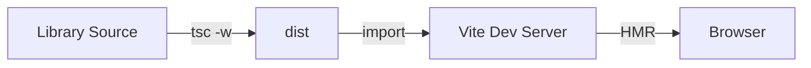

# Setting Up Live-Reloading for Shared Libraries in a Vite Monorepo

## Package Structure

```
apps/
  └── admin/        # Vite 앱

packages/
  └── ui/           # Component library
  └── utils/        # Utility functions

```

## Development Workflow



### 1. Library Development

#### TypeScript (`tsc -w`)

- Watches `.ts`, `.tsx` changes
- Automatic compilation to `.js`,`.d.ts` files in `dist` folder

#### CSS (`cpx -w`)

- Watches `src/styles/**`
- Automatic copying to `dist` folder

### 2. Application Development

#### Vite Dev Server

- Monitors `dist/` changes
- Browser auto-updates via HMR
- Immediate reflection of library changes

## Execution Strategy

### 1. Script Settings

<details> <summary><code>root/package.json</code> scripts</summary>

```
"tsc:build": "pnpm --filter=@caterly/utils run build && pnpm --filter=@caterly/ui run tsc:build"
"predev": "pnpm --filter=@caterly/utils run dev & pnpm --filter=@caterly/ui run dev"
"dev:admin": "pnpm run predev & pnpm --filter=admin run dev"
```

- `&` runs multiple commands in parallel, without waiting for the previous one to finish.
- `&&` runs the next command only if the previous one completes successfully.
</details>

<details> <summary><code>packages/*/package.json</code> scripts</summary>

```
"copy:css": "cpx \"src/styles/**/\*\" dist/styles"
"copy:css:watch": "cpx -w \"src/styles/**/\*\" dist/styles"
"tsc:build": "tsc -p tsconfig.json & pnpm run copy:css"
"dev": "tsc -w & pnpm run copy:css:watch"
```

</details>

### 2. Workspace Linking

```
"dependencies": {
	"@caterly/utils": "workspace:*",
	"@caterly/ui": "workspace:*",
},
```

📄 For installation and environment setup, refer to [Getting Started guide](https://github.com/jiaah/Caterly?tab=readme-ov-file#-getting-started)

## Summary

| Item                 | Strategy/Explanation                                  |
| -------------------- | ----------------------------------------------------- |
| Library dev          | `tsc -w`, `cpx -w` for real-time compilation          |
| App dev              | Vite dev server with HMR                              |
| Library → App Link   | Use `workspace:*` for internal dependencies           |
| Real-time Reflection | Changes in `dist` trigger Vite’s HMR reload           |
| Dev Execution Mode   | Run watch scripts in parallel with `&`                |
| Build/Test Execution | Run in sequence with `&&` to respect dependency graph |

## Key Considerations

1. **Turbo dependsOn Limitation**

   - Avoid `dependsOn: ['^dev']` for watch mode
   - Reason: `tsc -w` doesn't respect dependency order

## Common Issues

1. **Build Conflicts**

   - Solution: Run `pnpm clean` before development
   - Avoids conflicts between Vite build outputs and TypeScript’s dist files.

2. **TypeScript Watch Issues**

   - Solution: Ensure no conflicting `dist` folders exist

3. **HMR Not Working**

   - Solution: Check if all watch processes are running
